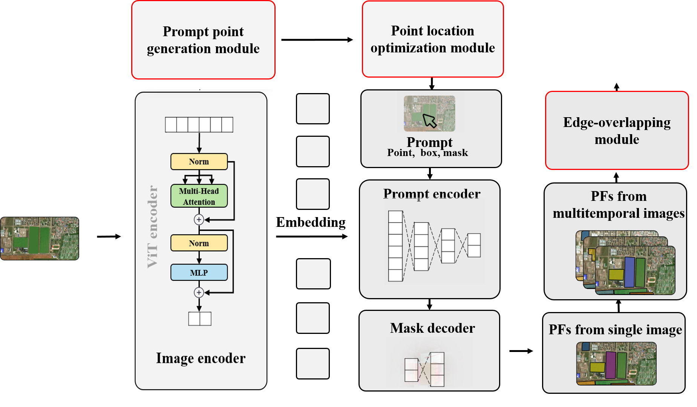

# STAMP Software

**[Beijing Normal University, CHEN-Lab](http://www.chen-lab.club/)**

[Shuaijun Liu](https://alex1234.github.io/), [Dong Qi], [Xuehong Chen], [Xiuchun Dong], [Ping Huang], [Peng Yang], [Jin Chen]

[[`Paper`]] [[`Demo`](https://segmeg.com/demo)]


**An adaptive Segment Anything Model (SAM) for the task of planted field segmentation from remote sensing imagery** produces high quality Planted field masks from remote sensing image, and it can be used to extract PF in an image. It has been improved based on 'Segment Anything Model', and has strong zero-shot performance on a remote sensing image.

<p align="center">
  
</p>

## Installation

The code requires `python>=3.8`, as well as `pytorch>=1.7` and `torchvision>=0.8`. Please follow the instructions [here](https://pytorch.org/get-started/locally/) to install both PyTorch and TorchVision dependencies. Installing both PyTorch and TorchVision with CUDA support is strongly recommended.

Install Segment Anything:

```
pip install STAMP.git
```

or clone the repository locally and install with

```
git clone git@github.com:STAMPg.git
cd STAMP; pip install -e .
```

The following optional dependencies are necessary for mask post-processing,`jupyter` is also required to run the example notebooks.

```
pip install opencv-python pycocotools matplotlib onnxruntime onnx
```

## <a name="GettingStartedForSTAMP"></a>Getting Started

First download STAMP. Then the model can be used in just a few lines to get masks:

```
from STAMP import auotSTAMP
stamp = auotSTAMP["<model_type>"]
predictor = stamp(pic)
predictor.set_image(<your_image>)
masks, _, _ = predictor.predict(<input_prompts>)
```

or generate masks for an entire image:

```
from STAMP import STAMPWindow
stampWindow = STAMPWindow()
mask_generator = stampWindow(your_image)
masks = mask_generator.generate(your_image)
```

See the examples notebooks on [using SAM with prompts](/notebooks/STMAP_example.ipynb) for more details.

<p float="left">
  
  
</p>

### Software demo

The `STAMP` folder has a simple one page app which shows how to run mask prediction with the exported model in aexecutable program. Please see [`STAMPWindow.md`](https://github.com/LiuSjun/STAMP/README.md) for more details.

## <a name="Models"></a>Model Select

Three model versions of the model are available with different time-consuming models. These models can be instantiated by running


Click the links below to download the checkpoint for the corresponding model type.


## License

The model is licensed under the [beta 3.0.4 license](LICENSE).

## Contributing

See [contributing] and the [code of conduct].

## Contributors

The STAMP project was made possible with the help of many contributors (alphabetical):

Liu Shuaijun, Chen Jin, Dong Qi, Chen Xuehong

## Citing Segment Anything

If you use SAM or SA-1B in your research, please use the following BibTeX entry.

```
@article{kirillov2023stamp,
  title={STAMP},
  author={Liu Shuaijun, Dong Qi, Dong Chunxiu, Huang Ping, Yang Peng, Chen Xuehong, Chen Jin},
  journal={arXiv:####},
  year={2023}
}
```
