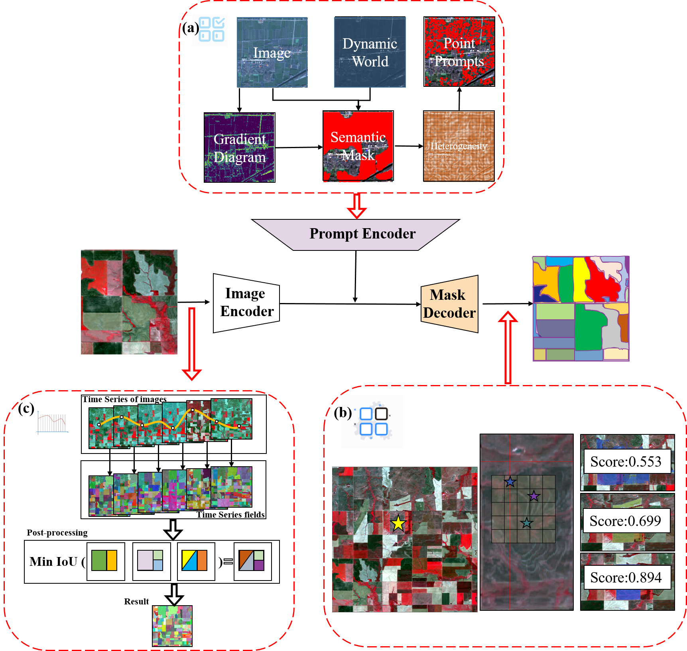

# STAMP Software

**[Beijing Normal University, CHEN-Lab](http://www.chen-lab.club/)**

[Shuaijun Liu](https://alex1234.github.io/), [Dong Qi], [Jin Chen]

[[`Paper`]] [[`Demo`](https://segmeg.com/demo)]


The **adaptive SAM for the Task of Planted field (PF) segmentation (STAMP)** produces high quality Planted field masks from remote sensing image, and it can be used to extract PF in an image. It has been improved based on 'Segment Anything Model', and has strong zero-shot performance on a remote sensing image.

<p float="left">
  
</p>

## Installation

The code requires `python>=3.8`, as well as `pytorch>=1.7` and `torchvision>=0.8`. Please follow the instructions [here](https://pytorch.org/get-started/locally/) to install both PyTorch and TorchVision dependencies. Installing both PyTorch and TorchVision with CUDA support is strongly recommended.

Install Segment Anything:

```
pip install STAMP.git
```

or clone the repository locally and install with

```
git clone git@github.com:STAMPg.git
cd STAMP; pip install -e .
```

The following optional dependencies are necessary for mask post-processing,`jupyter` is also required to run the example notebooks.

```
pip install opencv-python pycocotools matplotlib onnxruntime onnx
```

## <a name="GettingStarted"></a>Getting Started

First download STAMP. Then the model can be used in just a few lines to get masks from a given prompt:

```
from segment_anything import SamPredictor, sam_model_registry
sam = sam_model_registry["<model_type>"](checkpoint="<path/to/checkpoint>")
predictor = SamPredictor(sam)
predictor.set_image(<your_image>)
masks, _, _ = predictor.predict(<input_prompts>)
```

or generate masks for an entire image:

```
from segment_anything import SamAutomaticMaskGenerator, sam_model_registry
sam = sam_model_registry["<model_type>"](checkpoint="<path/to/checkpoint>")
mask_generator = SamAutomaticMaskGenerator(sam)
masks = mask_generator.generate(<your_image>)
```

Additionally, masks can be generated for images from the command line:

```
python scripts/amg.py --checkpoint <path/to/checkpoint> --model-type <model_type> --input <image_or_folder> --output <path/to/output>
```

See the examples notebooks on [using SAM with prompts](/notebooks/predictor_example.ipynb) and [automatically generating masks](/notebooks/automatic_mask_generator_example.ipynb) for more details.

<p float="left">
  
  
</p>

### Web demo

The `demo/` folder has a simple one page React app which shows how to run mask prediction with the exported ONNX model in a web browser with multithreading. Please see [`demo/README.md`](https://github.com/facebookresearch/segment-anything/blob/main/demo/README.md) for more details.

## <a name="Models"></a>Model Select

Three model versions of the model are available with different backbone sizes. These models can be instantiated by running

```
from segment_anything import sam_model_registry
sam = sam_model_registry["<model_type>"](checkpoint="<path/to/checkpoint>")
```

Click the links below to download the checkpoint for the corresponding model type.

- **`default` or `vit_b`: [ViT-B SAM model.]**
- `vit_l`: [ViT-L SAM model.]
- `vit_h`: [ViT-H SAM model.]

## License

The model is licensed under the [beta 3.0.4 license](LICENSE).

## Contributing

See [contributing] and the [code of conduct].

## Contributors

The STAMP project was made possible with the help of many contributors (alphabetical):

Leo Shuaijun, Chen Jin, Dong Qi, Chen Xuehong

## Citing Segment Anything

If you use SAM or SA-1B in your research, please use the following BibTeX entry.

```
@article{kirillov2023stamp,
  title={STAMP},
  author={Leo Shuaijun, Chen Jin, Dong Qi, Chen Xuehong},
  journal={arXiv:####},
  year={2023}
}
```
